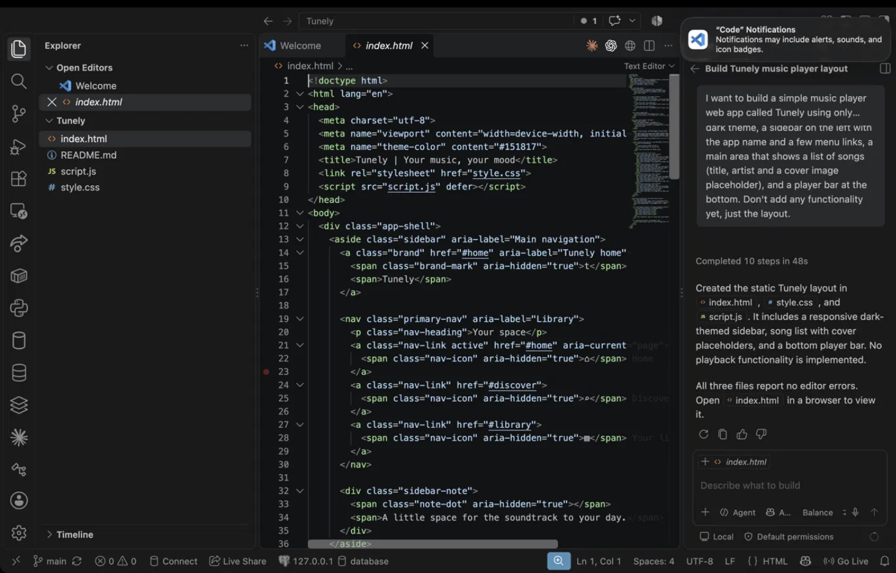
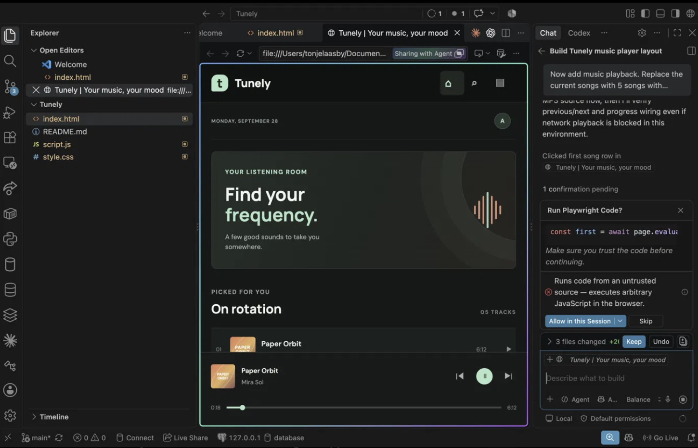
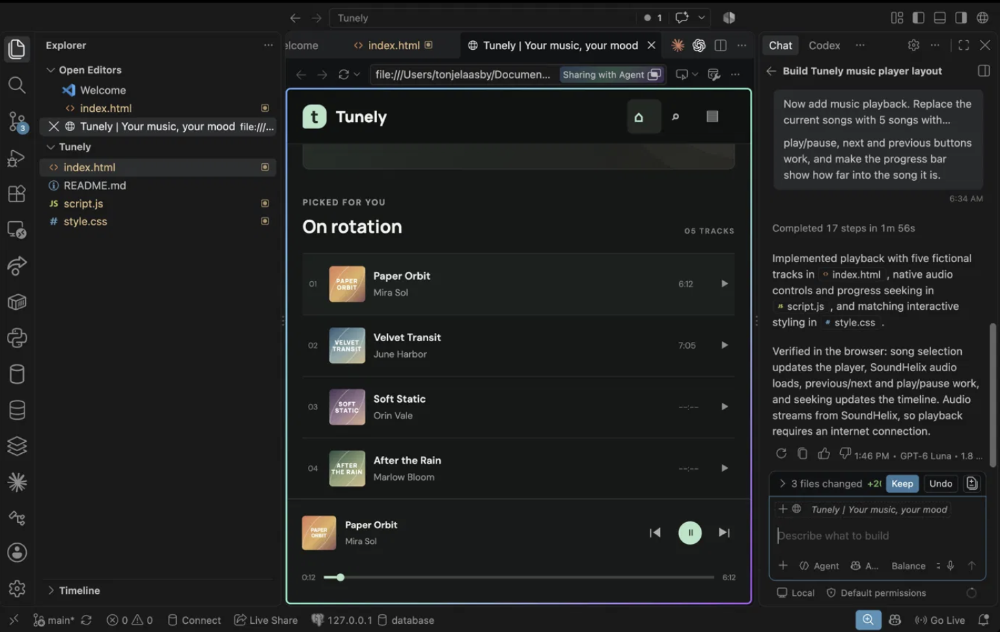
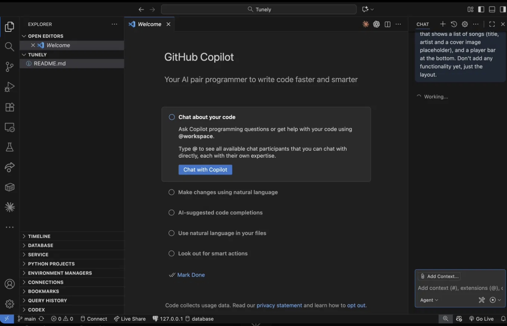
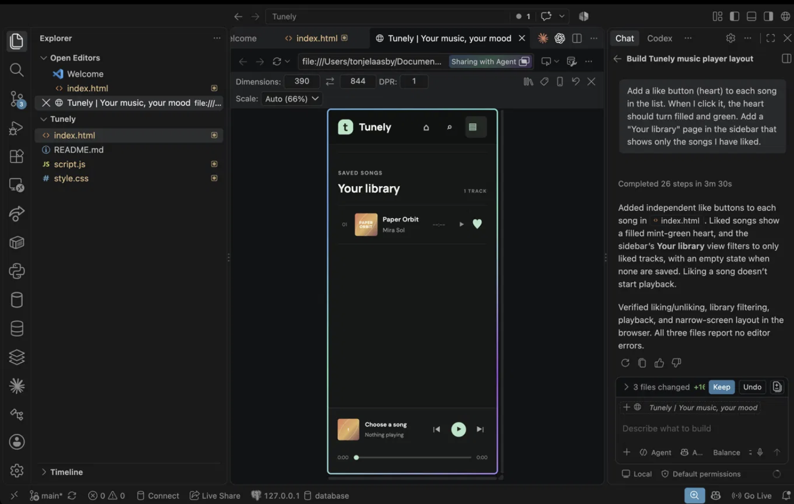
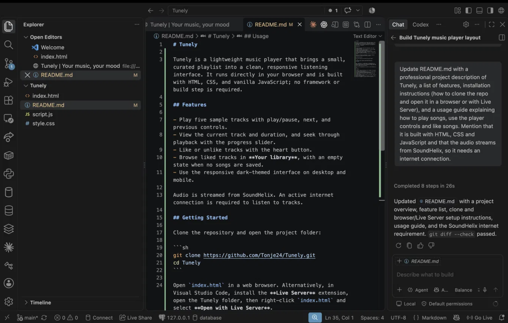

# Reflection

## What did you ask Copilot to help you build? How did you break down the problem?

I built Tunely, a simple music player web app inspired by Spotify. I used HTML, CSS and JavaScript.

I broke it into small steps and gave Copilot one feature at a time:

1. The basic layout (sidebar, song list, player bar), with no functionality yet
2. Music playback (play/pause, next, previous and a progress bar)
3. A like button and a "Your library" page
4. The README

## How did your approach to asking questions change as you worked?

My first prompt was long and described the whole layout. I also said "don't add any functionality yet" so Copilot would only focus on the design. That worked well.

After the first version I noticed Copilot used real songs and artists. So in my next prompt I asked it to use made-up names and free sample mp3 files. I learned to be more specific about what I wanted, and to fix small things in the next prompt instead of starting over.

## What parts of the development process with GitHub Copilot surprised you?

At first Copilot didn't work at all. It just said "Working..." and never answered. It turned out my VS Code was too old, so the Copilot Chat extension was disabled. After I updated VS Code it worked.

I was also surprised that Copilot asked for permission before running commands, and that it opened my app in its own browser to test it. It clicked on songs and even checked how the app looked on a phone screen. I didn't expect it to test its own work.

## What did you learn about the technology you used that you didn't know before?

I learned how HTML, CSS and JavaScript work together in separate files. I also learned that you can play music in the browser with an audio element and an mp3 link. I got more practice with git add, commit and push, and I learned that VS Code extensions need the right version of VS Code to work.

## What would you do differently if you had to build this again?

I would update VS Code and check that Copilot works before I start. I would also ask for made-up content from the start. And I would spend more time reading the code Copilot wrote, so I understand it better and don't just press Keep.

